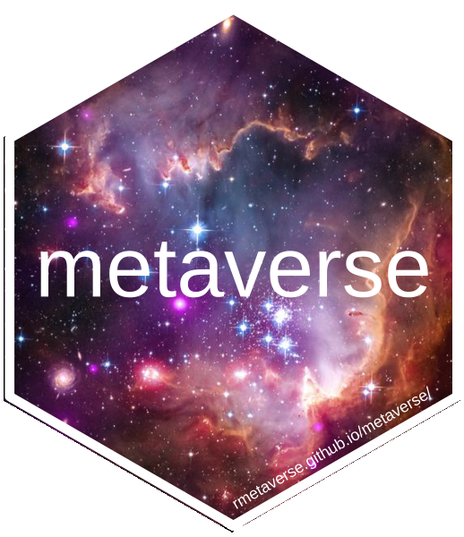

<!-- README.md is generated from README.Rmd. Please edit that file -->
metaverse 
============================================================================================

[](https://travis-ci.com/rmetaverse/metaverse/) [](https://codecov.io/gh/rmetaverse/metaverse)

Evidence synthesis (ES) is the process of identifying, collating and synthesising primary scientific research (such as articles and reports) for the purposes of providing reliable, transparent summaries.

The goal of this project is to collect, integrate and expand the universe of available functions for ES projects in R, via our proposed metaverse package. Like tidyverse, metaverse is envisioned as a collector package that makes it straightforward to install a set of functions – currently located in separate packages – for a common purpose.

Installation
------------

You can install the the development version from [GitHub](https://github.com/) with:

``` r
# install.packages("devtools")
# install.packages("remotes")
devtools::install_github("rmetaverse/metaverse", dependencies = TRUE)
```

On Linux, you may need to

``` bash
sudo apt install libudunits2-dev
```
